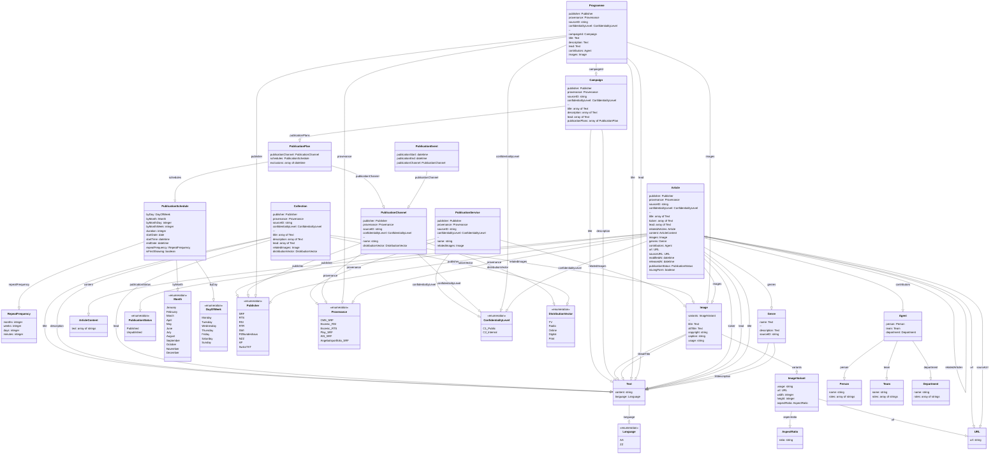

# PDPCore
#### Stand: 21.07.2023

```mermaid
classDiagram
class PublicationService {
    publisher: Publisher
    provenance: Provenance
    sourceID: string
    confidentialityLevel: ConfidentialityLevel
    --
    name: string
    relatedImages: Image
}
 
class PublicationChannel {
    publisher: Publisher
    provenance: Provenance
    sourceID: string
    confidentialityLevel: ConfidentialityLevel
    --
    name: string
    distributionVector: DistributionVector
}
 
class Collection {
    publisher: Publisher
    provenance: Provenance
    sourceID: string
    confidentialityLevel: ConfidentialityLevel
    --
    title: array of Text
    description: array of Text
    lead: array of Text
    relatedImages: Image
    distributionVector: DistributionVector
}
 
class Campaign {
    publisher: Publisher
    provenance: Provenance
    sourceID: string
    confidentialityLevel: ConfidentialityLevel
    --
    title: array of Text
    description: array of Text
    lead: array of Text
    publicationPlans: array of PublicationPlan
}
 
class PublicationPlan {
    publicationChannel: PublicationChannel
    schedules: PublicationSchedule
    exclusions: array of datetime
}
 
class PublicationSchedule {
    byDay: DayOfWeek
    byMonth: Month
    byMonthDay: integer
    byMonthWeek: integer
    duration: integer
    startDate: date
    startTime: datetime
    endDate: datetime
    repeatFrequency: RepeatFrequency
    isFirstShowing: boolean
}
 
class RepeatFrequency {
    months: integer
    weeks: integer
    days: integer
    minutes: integer
    }
 
class Text {
    content: string
    language: Language
}
 
class Image {
    variants: ImageVariant
    --
    title: Text
    altTitle: Text
    copyright: string
    caption: string
    usage: string
}
 
class ImageVariant {
    usage: string
    url: URL
    width: integer
    height: integer
    aspectRatio: AspectRatio
}
 
class AspectRatio {
    ratio: string
}
 
class URL {
    url: string
}
 
class PublicationEvent {
    publicationStart: datetime
    publicationEnd: datetime
    publicationChannel: PublicationChannel
}
 
class Programme {
    publisher: Publisher
    provenance: Provenance
    sourceID: string
    confidentialityLevel: ConfidentialityLevel
    --
    campaignId: Campaign
    title: Text
    description: Text
    lead: Text
    contributors: Agent
    images: Image
}
 
class Agent {
    person: Person
    team: Team
    department: Department
}
 
class Person {
    name: string
    roles: array of strings
}
 
class Team {
    name: string
    roles: array of strings
}
 
class Department {
    name: string
    roles: array of strings
}

class Article {
    publisher: Publisher
    provenance: Provenance
    sourceID: string
    confidentialityLevel: ConfidentialityLevel
    --
    title: array of Text
    kicker: array of Text
    lead: array of Text
    relatedArticles: Article
    content: ArticleContent
    images: Image
    genres: Genre
    contributors: Agent
    url: URL
    sourceURL: URL
    modifiedAt: datetime
    releasedAt: datetime
    publicationStatus: PublicationStatus
    isLongForm: boolean

}

class ArticleContent {
    text: array of strings
}

class Genre {
    name: Text
    --
    description: Text
    sourceID: string
}
 
class PublicationStatus {
    <<enumeration>>
    Published
    Unpublished
}

class Language {
    <<enumeration>>
    AA
    ZZ
}
 
class Month {
    <<enumeration>>
    January
    February
    March
    April
    May
    June
    July
    August
    September
    October
    November
    December
}
 
class DayOfWeek {
    <<enumeration>>
    Monday
    Tuesday
    Wednesday
    Thursday
    Friday
    Saturday
    Sunday
}
 
class Publisher {
   <<enumeration>>
   SRF
   RTS
   RSI
   RTR
   SWI
   PZBundeshaus
   NZZ
   AP
   SwissTXT
}
 
class Provenance {
   <<enumeration>>
   CMS_SRF
   Escenic_RSI
   Escenic_RTS
   Play_SRF
   AIS_SRF
   Angebotsportfolio_SRF
}
 
class ConfidentialityLevel {
    <<enumeration>>
    C1_Public
    C2_Internal
}
 
class DistributionVector {
    <<enumeration>>
    TV
    Radio
    Online
    Digital
    Print
}
 
PublicationService --|> Publisher: publisher
PublicationService --|> Provenance: provenance
PublicationService --|> ConfidentialityLevel: confidentialityLevel
PublicationService --|> Image: relatedImages
 
PublicationChannel --|> Publisher: publisher
PublicationChannel --|> Provenance: provenance
PublicationChannel --|> ConfidentialityLevel: confidentialityLevel
PublicationChannel --|> DistributionVector: distributionVector
 
Collection --|> Text: title
Collection --|> Text: description
Collection --|> Text: lead
Collection --|> Image: relatedImages
Collection --|> DistributionVector: distributionVector
 
Campaign --|> Text: title
Campaign --|> Text: description
Campaign --|> PublicationPlan: publicationPlans
 
PublicationPlan --|> PublicationChannel: publicationChannel
PublicationPlan --|> PublicationSchedule: schedules
 
PublicationSchedule --|> RepeatFrequency: repeatFrequency
PublicationSchedule --|> DayOfWeek: byDay
PublicationSchedule --|> Month: byMonth
 
Text --|> Language: language
 
Image --|> Text: title
Image --|> Text: altTitle
Image --|> ImageVariant: variants
 
ImageVariant --|> AspectRatio: aspectratio
ImageVariant --|> URL: url
 
PublicationEvent --|> PublicationChannel: publicationChannel
 
Programme --|> Text: title
Programme --|> Text: lead
Programme --|> Campaign: campaignId
Programme --|> Publisher: publisher
Programme --|> Provenance: provenance
Programme --|> ConfidentialityLevel: confidentialityLevel
Programme --|> Image: images
 
Agent --|> Person: person
Agent --|> Team: team
Agent --|> Department: department

Article --|> Article: relatedArticles
Article --|> Text: kicker
Article --|> Text: lead
Article --|> Text: title
Article --|> ArticleContent: content
Article --|> Publisher: publisher
Article --|> Provenance: provenance
Article --|> ConfidentialityLevel: confidentialityLevel
Article --|> Image: images
Article --|> Genre: genres
Article --|> Agent: contributors
Article --|> URL: url
Article --|> URL: sourceUrl
Article --|> PublicationStatus: publicationStatus

Genre --|> Text: title
Genre --|> Text: description
```
